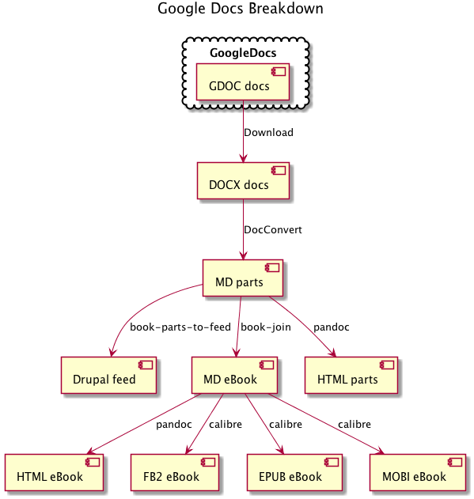
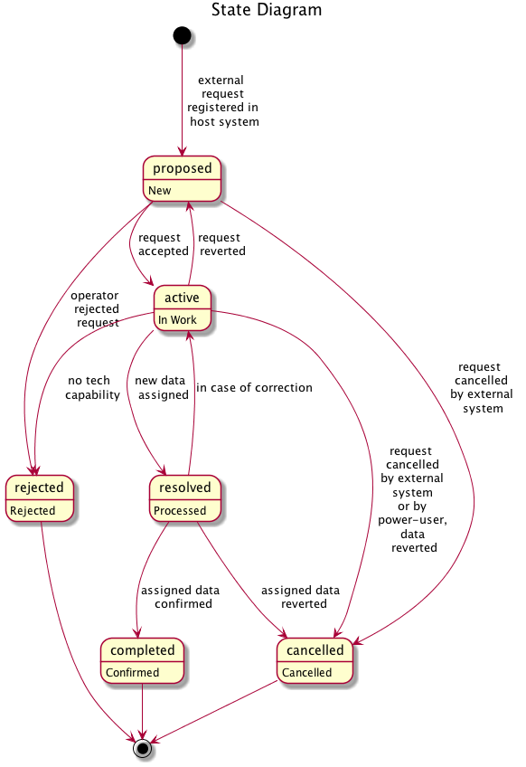
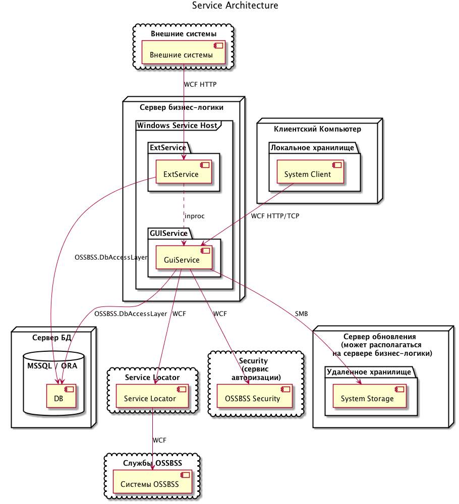
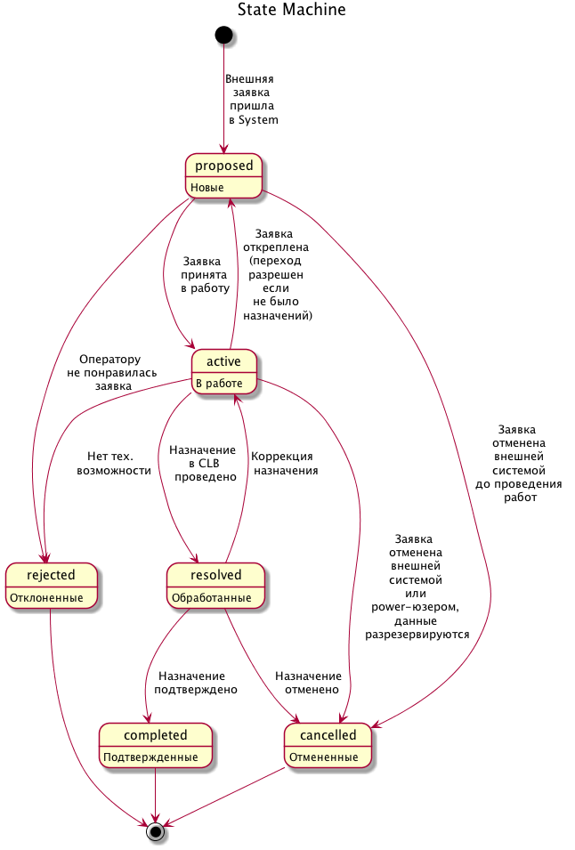

# Overview

This is a plugin that renders diagrams from your selection in Sublime Text 2
or 3.

By default, it binds the (Command / Alt)-M key and registers a command on the
Command Palette.  Simple select the text for your diagram and trigger the
command.  Multiselections are allowed.  Each diagram will be generated in a
uniquely named file.

If a diagram handler recognizes a diagram in the selection, it will render it
and pop it up in a detected viewer.  All files are created in such a way that
they will be cleaned up unless Sublime Text dies a particularly horrible death.

If you wish to override the viewer used, disable start-time sanity checks, or
change the default character set for diagram files, create a user version of
Diagram.sublime-settings file in the usual way.

# Features

## Internationalization (i18n)

Sublime handles all encodings internally as Unicode.  PlantUML is given UTF-8
encoding.  This generally means that you should have solid support for
internationalized text and filenames, within the limits of Sublime, PlantUML,
and your Operating System.

If, for some reason, you need PlantUML to receive an encoding other than UTF-8,
use the 'charset' property to use a different one.

## File Names

Specifying `<<file-suffix>>` at the beginning of the title will provide an
output file suffixed with that name.  This is useful in files with multiple
diagrams so that they are generated with intelligible and predictable names.
The filename annotation will be stripped from the final diagram.  There is
currently no way to specify a filename completly different from your source
file as a security feature to prevent easy overwriting of other files.

## Operating System Support

Operating Systems:  MacOS X, Linux, Windows (with default system viewer)
Diagram Types: PlantUML
Viewers (in order of preference):

* MacOS X Preview
* MacOS X QuickLook
* Eye of Gnome

Patches to support additional viewers or diagrams are welcome.

# Installation

Check out the source directory or download and uncompress the source tarball.
Put this directoy in the Packages directory for your platform.  Or install via
Package Control.

On Linux, it's sometimes "~/.config/sublime-text-2/Packages/".
On MacOS X, it's "~/Library/Application Support/Sublime Text 2/Packages/".

Sublime Text should detect the plugin and automatically load it.

Dependencies to function correctly are:

* Java (download from java.sun.com)
* Graphviz (I recommend "homebrew" on the Mac)
* Sublime Text 2 or 3

The source is available via git at:

<https://github.com/jvantuyl/sublime_diagram_plugin.git>

Or as a tarball at:

<https://github.com/jvantuyl/sublime_diagram_plugin/tarball/master>

# Sample Results

Source to these examples is available in the
[samples folder](https://github.com/jvantuyl/sublime_diagram_plugin/tree/master/samples).

## Basic Diagrams

## Internationalization (i18n)

# Thanks

Special thanks to all of those who have contributed code and feedback,
including:

* Tobias Bielohlawek (Syntax Highlighting Support)
* Julian Godesa (UX Feedback)
* Seán Labastille (Preview Support, Multi-Diagram Support)
* Kirk Strauser (Python 3 / SublimeText 3 Support)
* Stanislav Vitko (PlantUML Updates)
* Constantine ? (Windows Viewer, Charset Support, Various Other Fixes)
* Marcelo Da Cruz Pinto (Windows Viewer)
* Peter Ertel (PEP8 Cleanup, Windows Improvements)
* Juan Cabrera (Version Updates)
* Homeway Xue (Internationalization, File Naming)
